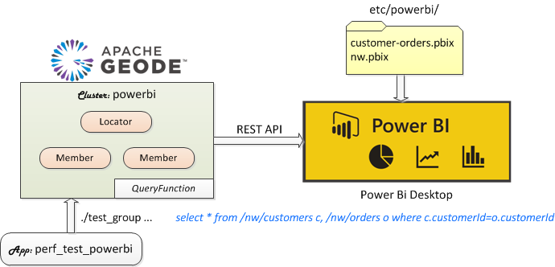
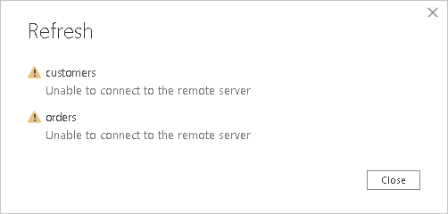
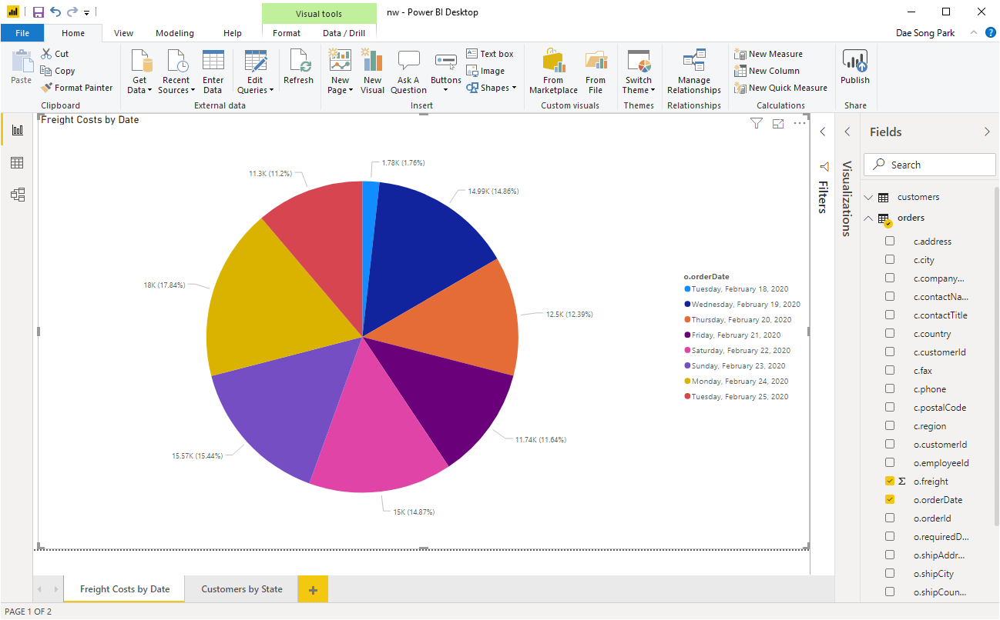
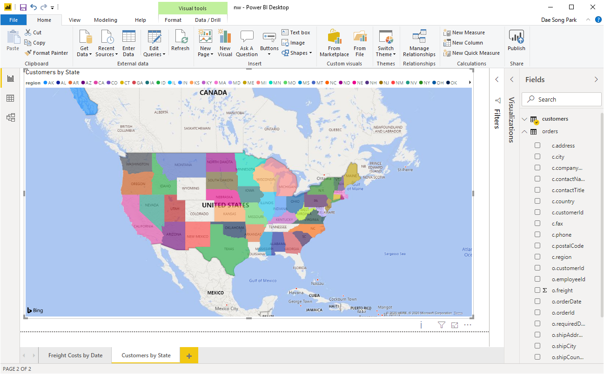

# Bundle: Power BI

This bundle contains a Microsoft Power BI example that interfaces Power BI with Geode/GemFire via the REST API. 

This article can be viewed in your browser by running the following:

```bash
show_bundle bundle-geode-1-app-perf_test_powerbi-cluster-powerbi
```

## Installing Bundle

 [*Driven by PadoGrid*](https://github.com/padogrid)

```bash
install_bundle -download bundle-geode-1-app-perf_test_powerbi-cluster-powerbi
```

## Use Case

In this use case, we integrate Microsoft Power BI with Geode/GemFire using the REST API to invoke the `QueryFunction` plugin included in the `geode-addon` distribution. We join co-located regions in our queries via the `QueryFunction` plugin and perform visual analytics from Power BI.




## Running Cluster

The bundle installs the `powerbi` cluster which can be started as follows:

```bash
# Switch into the powerbi cluster
switch_cluster powerbi

# Add a locator and two (2) members to the cluster
add_locator; add_member; add_member

# Start the cluster
start_cluster
```

## Running `perf_test_powerbi` App

The bundle includes the `perf_test_powerbi` app with the preconfigured `etc/group-factory.properties` file for ingesting mock `Customer` and `Order` objects into the `powerbi` cluster which you started from the previous section.

Run the `test_group` command to ingest the data as follows:

```bash
cd_app perf_test_powerbi; cd bin_sh

# First, built the app
./build_app

# Run test_group to ingest mock data into /nw/customers and /nw/orders
./test_group -prop ../etc/group-factory.properties -run
```

The above command ingests small sets of data as follows.

| Region        | Count |
| ------------- | ----- |
| /nw/customers | 100   |
| /nw/orders    | 1000  |

You can increase the number of entries in the `etc/group-factory.properties` file by changing the group properties.

```bash
cd_app perf_test_powerbi
vi etc/group-factory.properties
```

The following properties should be changed.

```properties
# customers 
g1.totalInvocationCount=100

# orders
g3.totalInvocationCount=1000

# If you changed the customer count then you should also consider changing the
# max number of customers to include them in the generated orders. This value is
# the upper bound of the customer ID that will be assigned to orders. If you want
# all of the customers to have orders then set it to the same value as g1.totalInvocationCount.
put2.factory.customerId.max=100
```

## Loading .pbix Files

The following `.pbix` files are included in the bundle. You can load them from the Power BI Desktop.

```bash
cd_app perf_test_powerbi
tree etc/powerbi/
```

**Output:**

```console
etc/powerbi/
├── customer-orders.pbix
└── nw.pbix
```

### customer-orders.pbix

This Power BI file interfaces Geode/GemFire using the function, `QueryFunction` provided by `geode-addon`. It queries customer and order objects by executing the following OQL query:

```sql
select * from /nw/customers c, /nw/orders o where c.customerId=o.customerId
```

To join Geode/GemFire regions, the regions must be colocated. The `powerbi` cluster has been preconfigured to co-locate `/nw/customers` and `/nw/orders` regions using the generic partition resolver, `IdentityKeyPartitionResolver`, provided by `geode-addon`. To properly use `IdentityKeyPartitionResolver`, the entry key must be a composite string that contains the routing key separated by the default delimiter '.' (period). For the `powerbi` cluster, the routing key is the second token of the entry key string. For example, the order entry key, `k0000000920.000000-0055` contains the customer ID, `000000-0055` as the routing key.

**CURL:**

```bash
curl -X POST "http://localhost:7080/geode/v1/functions/addon.QueryFunction?onRegion=%2Fnw%2Forders" \
     -H "accept: application/json" -H "Content-Type: application/json" \
     -d "[ { \"@type\": \"String\",\"@value\": \"select * from /nw/customers c, /nw/orders o where c.customerId=o.customerId limit 100\"}]"
```

**Power Query M:**

```basic
let
    url = "http://localhost:7080/geode/v1/functions/addon.QueryFunction?onRegion=/nw/orders",
    content = "[{""@type"": ""String"",
            ""@value"": ""select * from /nw/customers c, /nw/orders o where c.customerId=o.customerId""}]",
    Source = Json.Document(Web.Contents(url, [Content=Text.ToBinary(content)])),
    CombinedSources = List.Combine(Source),
    #"Converted to Table" = Table.FromList(CombinedSources, Splitter.SplitByNothing(), null, null, ExtraValues.Error),
    #"Expanded Column1" = Table.ExpandRecordColumn(#"Converted to Table", "Column1", {"c", "o"}, {"c", "o"}),
    #"Expanded o" = Table.ExpandRecordColumn(#"Expanded Column1", "o", {"orderId", "customerId", "employeeId", "orderDate", "requiredDate", "shippedDate", "shipVia", "freight", "shipName", "shipAddress", "shipCity", "shipRegion", "shipPostalCode", "shipCountry"}, {"o.orderId", "o.customerId", "o.employeeId", "o.orderDate", "o.requiredDate", "o.shippedDate", "o.shipVia", "o.freight", "o.shipName", "o.shipAddress", "o.shipCity", "o.shipRegion", "o.shipPostalCode", "o.shipCountry"}),
    #"Expanded c" = Table.ExpandRecordColumn(#"Expanded o", "c", {"customerId", "companyName", "contactName", "contactTitle", "address", "city", "region", "postalCode", "country", "phone", "fax"}, {"c.customerId", "c.companyName", "c.contactName", "c.contactTitle", "c.address", "c.city", "c.region", "c.postalCode", "c.country", "c.phone", "c.fax"}),
    #"Changed Type" = Table.TransformColumnTypes(#"Expanded c",{{"o.orderDate", type date}, {"o.requiredDate", type date}, {"o.shippedDate", type date}, {"o.shipVia", type number}, {"o.freight", Currency.Type}}),
    #"Sorted Rows" = Table.Sort(#"Changed Type",{{"c.customerId", Order.Ascending}})
in
    #"Sorted Rows"
```

### nw.pbix

This Power BI file interfaces Geode/GemFire using two separate queries as follows.

```sql
select * from /nw/customers
select * from /nw/orders
```

The results of the queries are then merged into one (1) table using Power Query M.

**CURL:**

```bash
# customers
curl -X GET "http://localhost:7080/geode/v1/queries/adhoc?q=select%20*%20from%20%2Fnw%2Fcustomers%20limit%20100" \
     -H "accept: application/json;charset=UTF-8"

# orders
curl -X GET "http://localhost:7080/geode/v1/queries/adhoc?q=select%20*%20from%20%2Fnw%2Forders%20limit%20100" \
     -H "accept: application/json;charset=UTF-8"
```

**Power Query M:**

customers:

```basic
let
    Source = Json.Document(Web.Contents("http://localhost:7080/geode/v1/queries/adhoc?q=select * from /nw/customers")),
    #"Converted to Table" = Table.FromList(Source, Splitter.SplitByNothing(), null, null, ExtraValues.Error),
    #"Expanded Column1" = Table.ExpandRecordColumn(#"Converted to Table", "Column1", {"customerId", "companyName", "contactName", "contactTitle", "address", "city", "region", "postalCode", "country", "phone", "fax"}, {"customerId", "companyName", "contactName", "contactTitle", "address", "city", "region", "postalCode", "country", "phone", "fax"})
in
    #"Expanded Column1"
```

orders:

```basic
let
    Source = Json.Document(Web.Contents("http://localhost:7080/geode/v1/queries/adhoc?q=select * from /nw/orders")),
    #"Converted to Table" = Table.FromList(Source, Splitter.SplitByNothing(), null, null, ExtraValues.Error),
    Table = Table.ExpandRecordColumn(#"Converted to Table", "Column1", {"orderId", "customerId", "employeeId", "orderDate", "requiredDate", "shippedDate", "shipVia", "freight", "shipName", "shipAddress", "shipCity", "shipRegion", "shipPostalCode", "shipCountry"}, {"o.orderId", "o.customerId", "o.employeeId", "o.orderDate", "o.requiredDate", "o.shippedDate", "o.shipVia", "o.freight", "o.shipName", "o.shipAddress", "o.shipCity", "o.shipRegion", "o.shipPostalCode", "o.shipCountry"}),
    #"Changed Type1" = Table.TransformColumnTypes(Table,{{"o.shipVia", type number}, {"o.orderDate", type date}, {"o.requiredDate", type date}, {"o.shippedDate", type date}}),
    #"Changed Type" = Table.TransformColumnTypes(#"Changed Type1",{{"o.requiredDate", type date}, {"o.orderDate", type date}, {"o.shippedDate", type date}, {"o.freight", type number}}),
    #"Rounded Off" = Table.TransformColumns(#"Changed Type",{{"o.freight", each Number.Round(_, 2), type number}}),
    #"Merged Queries" = Table.NestedJoin(#"Rounded Off", {"o.customerId"}, customers, {"customerId"}, "customers", JoinKind.LeftOuter),
    #"Expanded customers" = Table.ExpandTableColumn(#"Merged Queries", "customers", {"customerId", "companyName", "contactName", "contactTitle", "address", "city", "region", "postalCode", "country", "phone", "fax"}, {"c.customerId", "c.companyName", "c.contactName", "c.contactTitle", "c.address", "c.city", "c.region", "c.postalCode", "c.country", "c.phone", "c.fax"})
in
    #"Expanded customers"
```

## Power BI Desktop

After loading the `.pbix` files, click on the **Home/Refresh** icon in the tool bar.

If the **Home/Refresh** button shows the Refresh error window similar to shown below, then you are not running PowerBI in the same host as the Geode cluster, which has been configured to run on localhost in this bundle.



If you see the Refresh error then you will need to change your Geode cluster configuration and restart it as follows.

1. Change bind address for the cluster

```bash
cd_cluster
vi etc/cluster.properties
```

Replace `localhost` with the cluster host name or IP that can be reached by PowerBI.

```properties
...
cluster.bindAddress=<cluster-host-ip>
cluster.hostnameForClients=<cluster-host-ip>
...
```

2. Change perf_test client configuration

```bash
cd_app perf_test_powerbi
vi etc/client-cache.xml
```

Replace `localhost` with the cluster host name or IP.

```xml
...
    <pool name="serverPool">
         <locator host="<cluster-host-ip>" port="10334" />
    </pool>
...
```

3. Restart the cluster

```bash
stop_cluster -all
start_cluster
```

You must now replace `localhost` with the cluster host name or IP as in the data source URLs from PowerBI. This is done by selecting the **Transform data/Transform data** pulldown menu item to open the Power Query Editor and select the **Home/Advanced Editor** menu button from there. 

### Freight Costs by Date



### Customers by State



## Teardown

```bash
stop_cluster -all
```

## Conclusion

Integrating Power BI with Geode/GemFire is a trivial task using the Geode/GemFire REST API. For simple queries and small result sets, the REST API provides a quick and simple way to retrieve data in real time. However, the lack of OQL support for non-colocated data and the poor support for streaming large result sets greatly hamper its usability. The Geode/GemFire query service is not for executing complex queries and for returning large result sets. For that, a separate data extraction service is needed.
